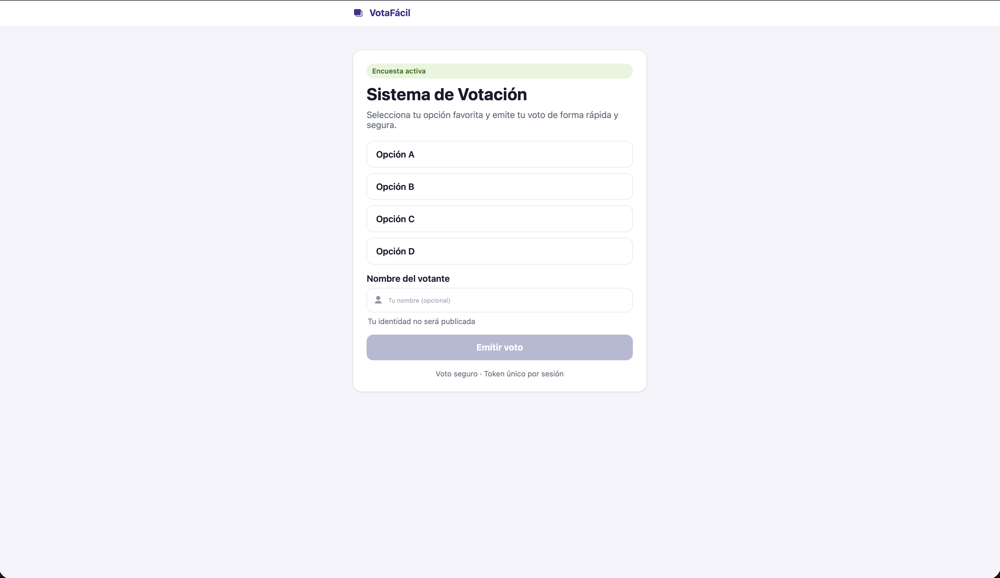
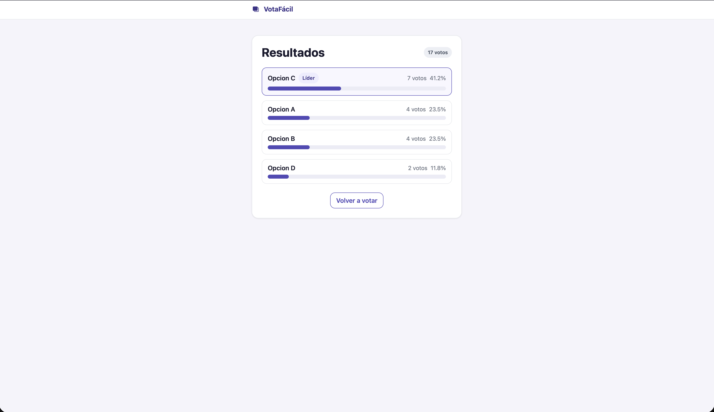

# Sistema de Votación en Línea

## Objetivo
Aplicación web desarrollada con Jakarta EE que permite a los usuarios
registrar votos en encuestas y consultar resultados en tiempo real,
con persistencia en base de datos relacional.

## Tecnologías utilizadas
- Java 17 + Jakarta EE 10
- Apache Tomcat 10
- MySQL 8
- JDBC (sin ORM)
- JSP / JSTL / HTML / CSS
- Maven

## Estructura del proyecto
```
src/
  main/
    java/
      com.votacion/
        servlet/   → VotacionServlet (/votar), ResultadosServlet (/resultados)
        dao/       → VotoDAO, ResultadosDAO
        model/     → Voto
        util/      → DBConnection
    webapp/
      css/           → estilos.css
      index.jsp      → Formulario de votación
      resultados.jsp → Tabla de resultados
      WEB-INF/web.xml
db/
  schema.sql → Script de inicialización de la base de datos
```

## Pasos de ejecución
1. Importar el proyecto en IntelliJ como proyecto Maven
2. Iniciar el servidor MySQL (por ejemplo con DBngin)
3. Ejecutar el script `db/schema.sql` en MySQL
4. Verificar credenciales en `util/DBConnection.java` (por defecto: `root` / `root`, puerto `3306`)
5. Desplegar en Tomcat 10 desde IntelliJ
6. Acceder a http://localhost:8080/votacion/

## Flujo de la aplicación
1. El usuario accede a `index.jsp` y selecciona una opción de la encuesta
2. El formulario envía un POST a `/votar` (`VotacionServlet`)
3. El servlet valida la opción, persiste el voto vía `VotoDAO` y redirige a `/resultados`
4. `ResultadosServlet` consulta el conteo de votos vía `ResultadosDAO` y hace forward a `resultados.jsp`
5. La JSP muestra la tabla con opción, votos y porcentaje

## Evidencia de ejecución
### Formulario de votación


### Resultados de la encuesta


## Avance actual
- [x] Estructura del proyecto
- [x] Configuración de Tomcat
- [x] Servlets básicos (VotacionServlet, ResultadosServlet)
- [x] JSP de votación y resultados
- [x] Conexión JDBC inicial
- [x] Base de datos (schema.sql)
- [ ] CRUD completo (Avance 2)

> Nota: para entornos reales, cambia estas credenciales por una contraseña segura y un usuario dedicado de aplicación.
